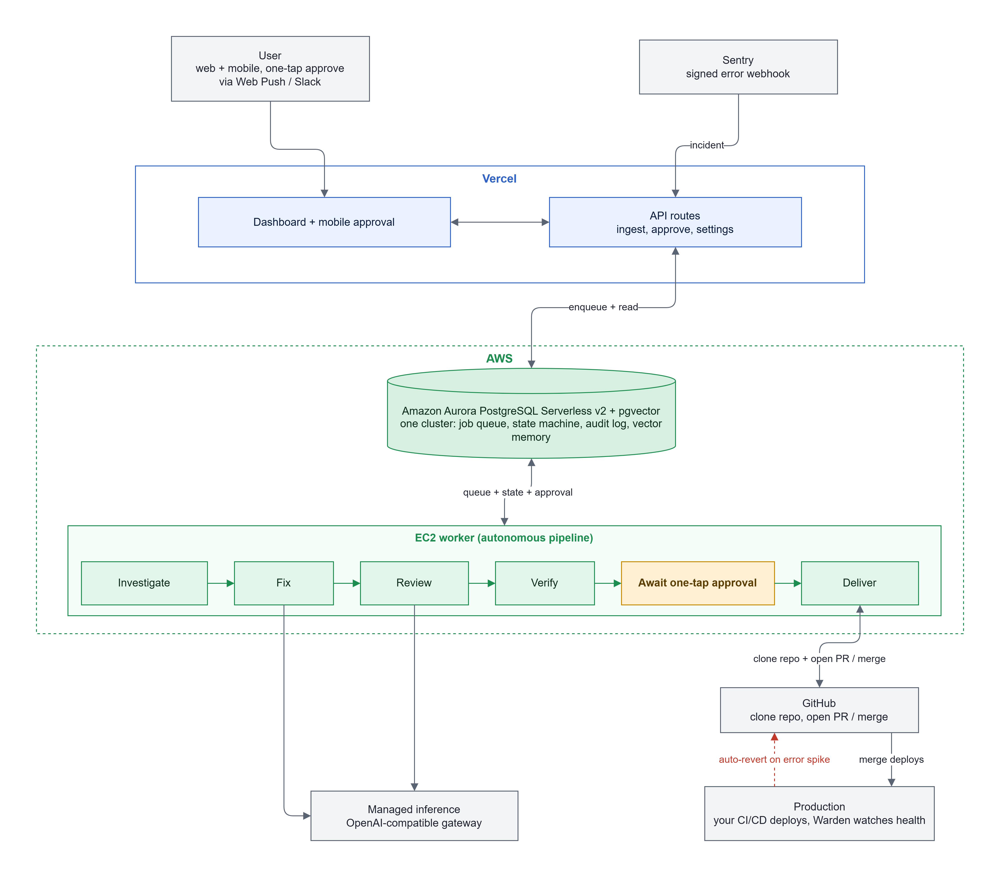

<div align="center">

<br />

<picture>
  <source media="(prefers-color-scheme: dark)" srcset="public/logo.png">
  
</picture>

**The on-call engineer you don't have.**

[](#tech-stack)
[](#why-aurora)
[](#tech-stack)
[](#license--credits)

**Live:** [warden-web-beta.vercel.app](https://warden-web-beta.vercel.app)

</div>

> Warden catches a production error, finds the root cause, writes the fix, **proves** it, and ships a pull request. The founder just taps approve.

## Overview

Warden is an autonomous on-call engineer for the millions of people shipping apps they can't debug. When production breaks, a non-technical founder can't read a stack trace, so Warden runs the whole loop for them:

1. **Detect:** a Sentry webhook delivers the exception (HMAC-verified).
2. **Investigate:** Warden reads the error, the stack, and the implicated code, read-only.
3. **Fix:** a model writes a patch on a fresh branch in a per-incident workspace.
4. **Review:** an independent panel of models from different labs cross-checks the diff, and they have to agree.
5. **Verify:** Warden replays the exact failing request to confirm the original error is gone, then re-runs the target's existing tests as a regression check so the fix can't break what was passing. Nothing ships on a model's say-so.
6. **Approve:** the founder gets a one-tap approval (web, push, or Slack). Approval is consent to ship, not a code review.
7. **Deliver:** Warden opens a pull request (or merges) on the linked repo, and the team's existing CI/CD ships it.

Every step is written to an append-only audit log, and Warden recognizes errors it has seen before via vector search. It runs in **simulation** mode (fully offline and deterministic) or **live** mode against real services.

The app and its APIs run on **Vercel**; the pipeline engine runs on an **AWS EC2** worker; and both coordinate through a single **Amazon Aurora** database, which holds the job queue, the incident state machine, the audit log, vector memory, and runtime settings.

<p align="center">
  
</p>

## Tech Stack

| Layer | Choice |
|---|---|
| Framework / Language | Next.js 16 (App Router), React 19, TypeScript 6 |
| Styling | Tailwind CSS v4 |
| Database | **Amazon Aurora PostgreSQL Serverless v2** with pgvector |
| Compute (engine) | AWS EC2, the always-on pipeline worker |
| Inference | OpenRouter (managed gateway: one key for Claude, GPT, Gemini, and more) via an OpenAI-compatible seam |
| Error source | Sentry (HMAC-verified webhook ingestion) |
| Delivery | GitHub (pull request or merge, OAuth or token) |
| Billing | Managed inference, metered from a prepaid wallet |
| Auth | Clerk (env-gated, optional) |
| Notifications | Web Push (VAPID), Slack (optional) |
| Testing | Vitest, gated on every build |
| Hosting | Vercel (app) plus AWS (Aurora and the EC2 worker) |

## Why Aurora

Aurora isn't just storage here; it's the product. A single Aurora PostgreSQL Serverless v2 cluster does quadruple duty:

- **State machine:** the incident lifecycle, enforced with transactional integrity.
- **Append-only audit log:** every agent action, for a complete trail.
- **pgvector memory:** Warden recognizes an error it has seen before.
- **Agent scorecard and runtime settings:** learning, plus live configuration.

We chose Aurora because the system needs **relational integrity *and* vector search in one place** (Postgres with pgvector), and **Serverless v2** scales down between incidents, which is the right shape for bursty, event-driven work.

## Getting Started

**Prerequisites:** Node.js 20+ LTS, Docker (for the local pgvector Postgres).

```bash
npm install
npm run setup     # start Postgres (Docker), run migrations, seed data
npm run dev       # http://localhost:3000
npm run worker    # (optional) the background pipeline worker
```

Warden defaults to **simulation** mode, so no external accounts or keys are needed. It runs the full detect, fix, verify, approve, and deliver loop offline against the bundled sample app. Open `/dashboard`, fire a sample incident, and watch the pipeline run.

## Project Structure

```
app/
├── dashboard/        # Incident feed and detail, metrics, audit, settings, API keys, usage
├── api/              # Route handlers (Sentry ingest, approve, settings, oauth, cron, ...)
├── approve/[id]/     # Mobile one-tap approval screen
├── report/[id]/      # Shareable incident report
└── _components/      # Shared UI primitives

lib/
├── orchestrator/     # Pipeline state machine and job runner
├── agents/           # Investigator, fixer, reviewer panel (OpenAI-compatible seam)
├── adapters/         # Sentry, GitHub, Vercel, per-incident git workspace, request-replay
├── repo/             # Data access (incidents, events, jobs, scorecard, wallet, settings)
├── statemachine/     # Incident transitions
├── policy/           # Guardrails (blast radius, reversibility, SQL guard)
├── auth/             # OAuth registry, API-secret gate, sessions
├── memory/ db/ sim/  # Embeddings, Postgres client, seeded sandbox bugs

migrations/           # Aurora / Postgres SQL migrations (0001 to 0010)
scripts/              # migrate, seed, worker, demo
sample-app/           # Bundled, zero-dependency target app for the offline demo
certs/                # Vendored Amazon RDS CA bundle (Aurora TLS)
Dockerfile            # The EC2 worker image
```

## Configuration

Set the following as environment variables (Vercel for the app, the worker's own environment for the engine). Full guidance is in [`docs/operations/go-live.md`](docs/operations/go-live.md).

| Variable | Required | Purpose |
|---|---|---|
| `DATABASE_URL` | yes | Aurora connection string. TLS is verified against the vendored RDS CA. |
| `WARDEN_MODE` | yes | `simulation` (default, offline) or `live`. |
| `WARDEN_API_SECRET` | live | Gates approve, rollback, and cron mutations; fails closed in live mode. |
| `OPENROUTER_API_KEY` | live | Managed inference. The engine routes every model through it (backend-only). |
| `SENTRY_CLIENT_SECRET` | live | Verifies inbound Sentry webhook signatures. |
| `GITHUB_TOKEN` / `GITHUB_OAUTH_CLIENT_ID` / `..._SECRET` | live | Clone the linked repo and open pull requests. |
| `BILLING_MODE` | optional | `managed` (metered wallet) or `byok`. |
| `VAPID_*`, `SLACK_*`, `CLERK_*` | optional | Push approvals, Slack approvals, dashboard auth. |

> Never commit real keys. `.env` is gitignored, and the worker reads its secrets from its own environment.

## Build & Deploy

```bash
npm run build   # type-check and Vitest, then next build
npm start       # serve the production build
```

- **App on Vercel:** push to `main` deploys production; pull requests get preview URLs.
- **Engine on AWS EC2:** the worker runs `npm run worker` on an always-on instance, since it needs git and a real filesystem to clone, boot, and replay. See [`docs/operations/deploy-aws.md`](docs/operations/deploy-aws.md) and the `Dockerfile`.
- **Migrations** in `migrations/` are applied with `npm run migrate`, not on deploy. A daily Vercel cron hits `/api/orchestrator/tick` as a recovery sweep; the EC2 worker is the real driver.

## Scripts

| Command | Does |
|---|---|
| `npm run dev` | Dev server (http://localhost:3000) |
| `npm run worker` | The background pipeline worker (drains the job queue) |
| `npm run build` | Type-check and tests, then production build |
| `npm test` | Run the Vitest suite once |
| `npm run lint` / `npm run typecheck` | ESLint / `tsc --noEmit` |
| `npm run migrate` / `npm run seed` | Apply migrations / seed data |
| `npm run setup` | Postgres up, migrate, and seed (one-shot local bootstrap) |
| `npm run demo` | Scripted end-to-end run (CLI) |

## Safety Model

- Agents have **no standing deploy authority**: only a human-issued approval moves a verified fix toward shipping.
- **Verification, not review, is the gate:** the test passes and the original error stops reproducing, deterministically. Reviewer agreement is a filter; disagreement escalates and never overrides a failed check.
- **Least privilege:** agents read the database through a read-only path, and delivery credentials never reach a model.
- Every change is **reversible**, and when uncertain, Warden escalates rather than guesses.

## License & Credits

Proprietary. © 2026 Arifur Rahman Akash. All rights reserved. No use, copying, modification, or distribution without written permission.

[](https://github.com/BlinkZ404)
[](mailto:arif.pcmr@gmail.com)
