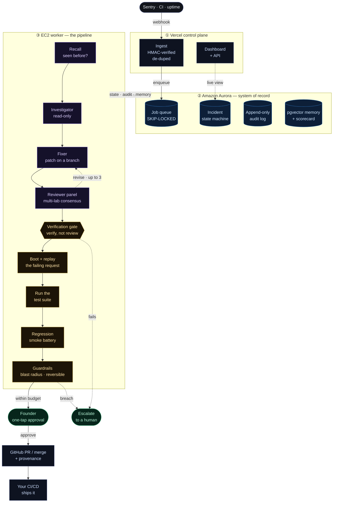

# Warden — architecture diagram

The system diagram for the submission. With the Mermaid Chart plugin installed it
renders inline in your editor; otherwise paste the block into <https://mermaid.live>
to export a PNG/SVG.

Three planes, decoupled, coordinating only through Amazon Aurora:

- **① Vercel control plane** — serverless, enqueue-only (a function can't run git or boot apps).
- **② Amazon Aurora** — the coordination layer and system of record.
- **③ EC2 worker** — the stateless execution pipeline.

## One-line narration (for the description / video)

Sentry reports a production error to the Vercel ingest route (HMAC-verified),
which records it in **Amazon Aurora** and enqueues a job. Vercel only enqueues; a
serverless function can't run git or boot an app. The **EC2 worker** claims the
job under a `SKIP-LOCKED` lease and runs the pipeline: recall (pgvector "seen this
before?"), read-only investigation, a fix on an isolated git branch, a multi-lab
reviewer panel, then the **verification gate**: it boots the app, **replays the
exact failing request**, runs the real test suite, and a regression smoke battery.
Guardrails enforce blast radius, protected paths, and reversibility. The founder
approves with one tap (consent, not code review), and the verified fix ships as a
GitHub PR or merge with deploy provenance for the team's CI/CD. Aurora is the
system of record throughout: the job queue, the incident state machine, an
append-only audit log, pgvector memory, the agent scorecard, and runtime settings.
Gate failures and guardrail breaches escalate to a human.

## How a verdict is decided (and the fix-iterate loop)

The reviewer panel is a **filter, not a vote**. Each reviewer returns
`approve | reject | uncertain` (no confidence score). `consensusOf` requires
**unanimous approval by default** to proceed; any shortfall escalates and the
dissent is recorded (`"only 2/3 approved; dissent: gpt-5.5=uncertain"`). Every
reviewer effectively holds a veto, so one skeptical model is enough to pull in a
human. We never adjudicate between the verdicts.

We deliberately do **not** weight by self-reported confidence or rank models by
"strength":

- Self-reported confidence is unreliable, so weighting by it would build the
  safety story on sand. The live reviewer is biased the other way ("prefer
  uncertain over approving a risky change").
- "Which model is stronger" is task-dependent with no ground truth at decision
  time, so any static ranking just encodes a guess.
- The panel's value is **decorrelation**: diverse model families catch different
  failure modes. Treating any doubt as escalation means we never have to decide
  which model is right.

This is safe because the panel is **not the decider**. Correctness is settled by
the **deterministic verification gate** (boot and replay the failing request, run
the test suite, the smoke battery), which is objective. Agent agreement can never
override a failed gate, and a passed gate still needs the panel not to dissent.

**The fix-iterate loop.** When the panel dissents, Warden does not always hand off
to a human. It checks whether the objection is **actionable** (today: an
over-scoped patch that touched files unrelated to the error). If it is, and the
attempt budget is not spent (`MAX_FIX_ATTEMPTS = 3`, one initial plus two
revisions), the reviewer's notes are fed back to the Fixer (*"A previous attempt
was rejected by review. Address this and keep the patch tightly scoped to ONLY
&lt;file&gt;: ..."*), which re-proposes a tighter fix. A non-actionable objection
(wrong file, a fundamental doubt) or an exhausted budget escalates immediately,
rather than looping on something the Fixer cannot address.

**Where model accuracy lives.** The agent **scorecard** in Aurora accumulates each
model's success rate per role over time. It informs **role assignment** (which
model you pick for the Fixer and the reviewer slots), not per-incident vote
weighting. Learning shapes configuration; it never silently tips a live safety
decision.
