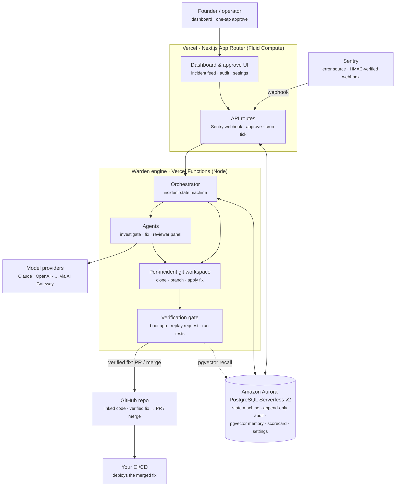

# Warden — architecture diagram

Source for the submission diagram. Render it to an image one of two ways:

- Open `architecture-diagram.html` in a browser and screenshot it, or
- Paste the Mermaid block below into <https://mermaid.live> and export a PNG/SVG.

Every box is labeled with **what it is** and **what it does**; arrows show call
direction. Amazon Aurora is the system of record at the center.

## One-line narration (for the description / video)

Sentry reports a production error to a Vercel API route, which records it in
**Amazon Aurora** and wakes the orchestrator. The orchestrator drives a state
machine — investigate, fix on an isolated git branch, review — then the
verification gate **boots the app and replays the real failing request** to prove
the error is gone. A verified fix is delivered as a PR or merge to the linked
GitHub repo, and the founder approves with one tap (or autopilot ships it).
Aurora is the system of record throughout: the state machine, an append-only
audit log, pgvector incident memory, the scorecard, and runtime settings.
