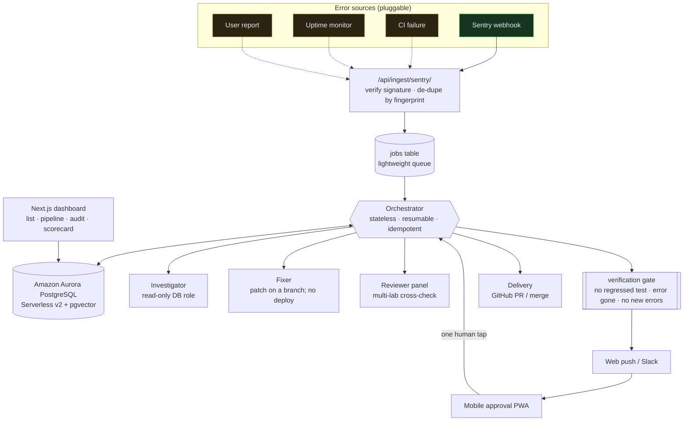
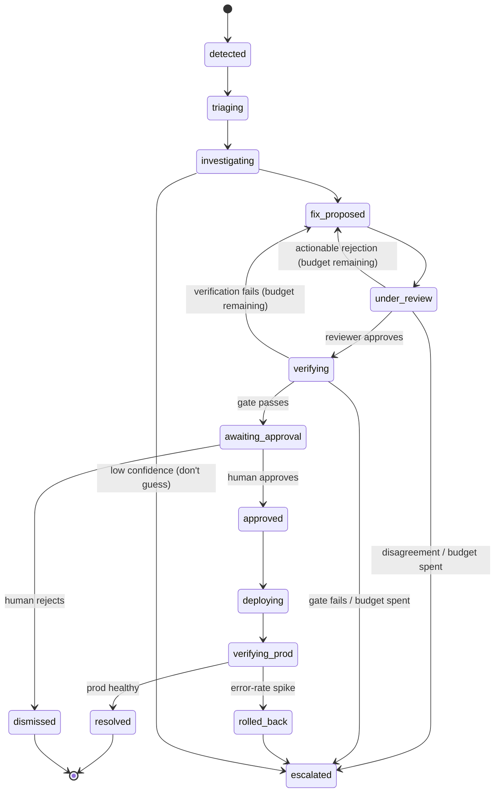
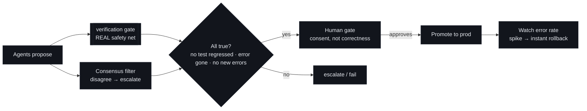

# Warden: Architecture (as built)

Warden is a **control plane** above commodity pieces (Sentry, Claude, OpenAI,
Vercel). The product is the orchestration, the safety model, and the database, not any single integration.

## Data flow

Solid = wired in v1. Dashed = clean stub seam (`lib/adapters/sources.ts`).

## Incident lifecycle (state machine)

Only the transitions below are legal (`lib/statemachine/transitions.ts`). There
is **no path to `deploying` that skips verification and a human approval row.**

Both `under_review` and `verifying` can loop back to `fix_proposed`: an actionable
reviewer objection or a failed verification re-proposes with that feedback under
one shared retry budget (`FIX_MAX_ATTEMPTS`, default 3 = 1 initial + 2 retries),
and escalates to a human only once the budget is spent.

## The database is the product

Aurora PostgreSQL is used as three things at once:

| Role | Tables |
|---|---|
| **State machine** | `incidents.status` (enum) + legal transitions |
| **Append-only event log (audit)** | `events`: the source of truth for "what happened" |
| **Vector memory** | `incidents.embedding` (pgvector): "have we seen this before?" |
| **Learning** | `agent_scorecard`: each agent's accuracy over time |

Per-incident artifacts: `investigations`, `fix_attempts`, `reviews`,
`verifications`, `approvals`, `deployments`, `outcomes`.

## The safety model

- Agents have **no standing deploy authority**. Only a human-written `approvals`
 row moves an incident out of `awaiting_approval`.
- Deterministic verification is the real gate, run as a regression check: the
 reviewer panel proves the fix is correct, then the target's existing suite
 confirms nothing previously green now fails (a previously-passing test that now
 fails blocks; no suite → proceed on the review) and request-replay confirms the
 original error is gone. Agent agreement is only a filter.
- Investigation uses a **read-only** DB connection (`readOnlyQuery`); writes
 there throw. Deploy credentials never reach the model.
- Every production change is reversible (Vercel instant rollback).

## Simulation vs. live

The principled line: **simulate what needs accounts/keys; keep the safety-critical
verification real.**

| Capability | Simulation (default, offline) | Live (`WARDEN_MODE=live` + key) |
|---|---|---|
| Error source | synthetic Sentry events | real Sentry webhook + HMAC verify |
| Fixer / Reviewer | deterministic, real git edits + real diff analysis | OpenRouter (managed inference) |
| Embeddings | local hashing vectorizer (deterministic) | embeddings API |
| Deploy / rollback | recorded, plausible URLs | Vercel API |
| Push delivery | recorded as a `notification` event | web-push (VAPID) |
| **Verification gate** | **REAL: runs the target app's tests + reproduction** | **REAL** |

Each capability flips independently when its secret is present, so a
half-configured environment still runs end to end.
